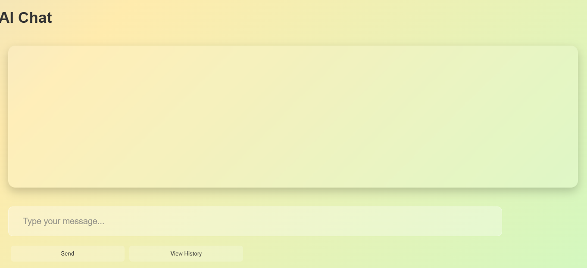
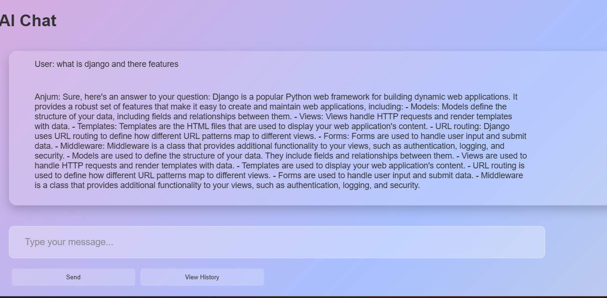
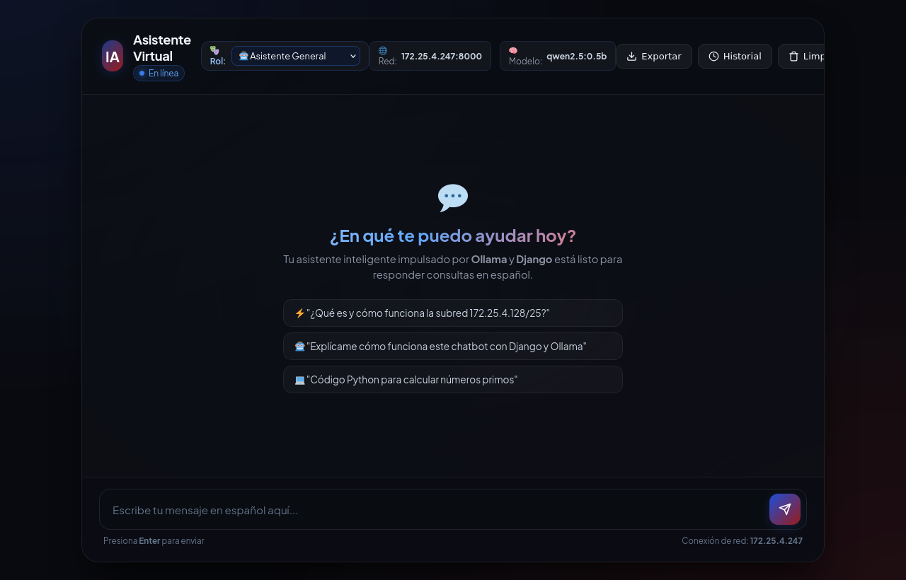
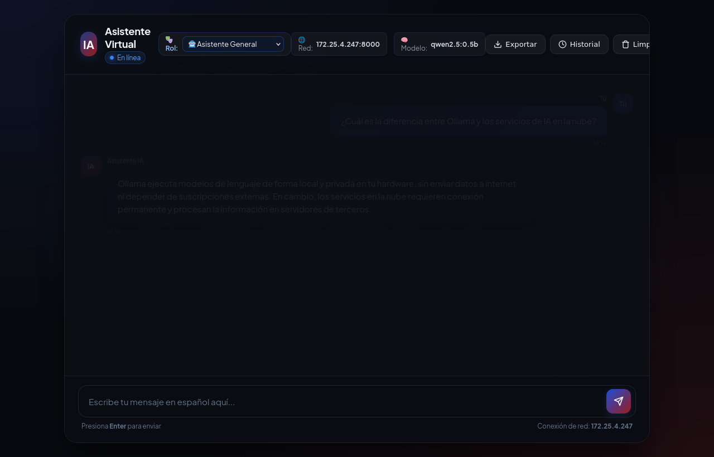
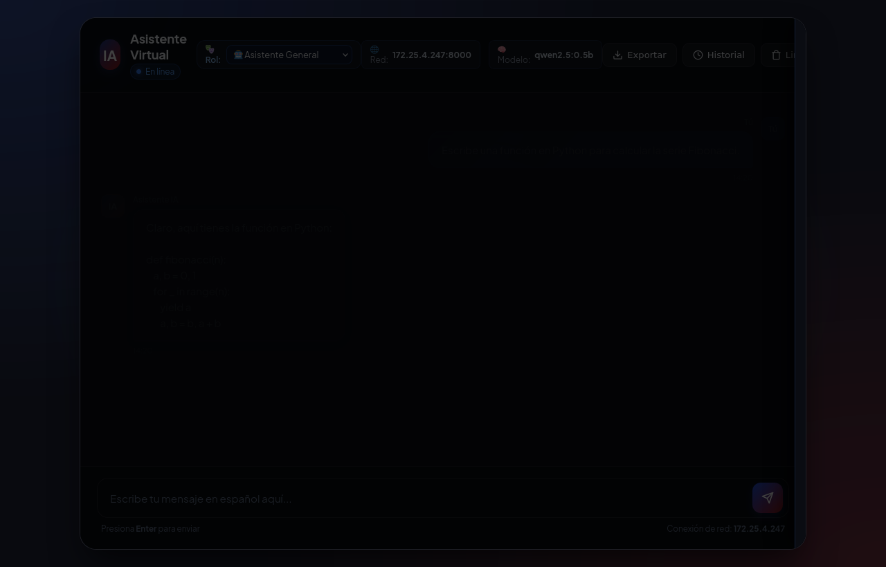

# Informe Técnico: Actividad 4 - Programación IV
## Implementación, Localización y Extensión de un Proyecto Open Source con Ollama

---

### Portada
* **Asignatura:** Programación IV  
* **Unidad:** Bloque 1 - Frameworks / Bloque 3 - Patrones de Diseño  
* **Tema:** Implementación, localización y extensión de un proyecto open source con Ollama o LlamaCpp  
* **Estudiante:** Gabriel Alcón  
* **Docente:** Profesor(a) de Programación IV  
* **Fecha:** 21 de Septiembre  
* **Entorno de Trabajo:** Debian Linux 12 x86_64, Python 3.11.2, Ollama 0.4.7, Django 5.1.6  

---

## Resumen Ejecutivo

El presente informe documenta el desarrollo integral de la **Actividad 4**, en la cual se asume el rol de desarrollador de software dentro de una empresa tecnológica orientada al despliegue de **Inteligencia Artificial Local**. El objetivo consistió en identificar un repositorio *open source* en GitHub (< 2 años de antigüedad) que utilizara **Ollama** o **LlamaCpp**, ponerlo en funcionamiento en un entorno Linux local, adaptarlo lingüística y funcionalmente al mercado hispanohablante (localización al español al 100%), e incorporar al menos dos funcionalidades innovadoras que aporten valor sin comprometer la estabilidad original del sistema.

---

## Punto 1: Identificación e Implementación del Proyecto Base (30 pts)

### 1.1 Selección del Repositorio Open Source
Se llevó a cabo una búsqueda de proyectos basados en modelos de lenguaje ejecutados localmente mediante Ollama. Se seleccionó el proyecto **ChatBot** desarrollado por el usuario *Anjum799*:

* **URL del Repositorio:** [https://github.com/Anjum799/ChatBot](https://github.com/Anjum799/ChatBot)
* **Fecha de Última Actualización:** Enero de 2025 (cumple el criterio de vigencia menor a 2 años: 2024–2026).
* **Descripción Original:** Aplicación web desarrollada con Django y LangChain que utiliza el runtime de Ollama para ejecutar modelos de lenguaje locales (originalmente `gemma:2b` o `mistral`) en un entorno interactivo offline.
* **Justificación de la Elección:** La arquitectura basada en Django con SQLite y LangChain ofrece una base idónea para aplicar patrones de diseño de software, refactorizar su capa de presentación y enriquecer sus capacidades mediante endpoints REST.

### 1.2 Preparación del Entorno, Dependencias y Configuración del Modelo
La implementación se realizó en una máquina con sistema operativo Linux Debian 12 de 64 bits.

#### Clonación del Repositorio y Creación del Entorno Virtual:
```bash
# Clonación del código fuente original desde GitHub
git clone https://github.com/Anjum799/ChatBot.git proyecto_original
cd proyecto_original

# Creación de entorno virtual aislado con Python 3.11
python3 -m venv .venv
source .venv/bin/activate
```

#### Instalación y Verificación de Dependencias:
```bash
# Actualización del gestor de paquetes pip e instalación de dependencias base
pip install --upgrade pip
pip install django djangorestframework langchain langchain-core langchain-ollama ollama requests
```

#### Verificación del Servicio de Ollama y Descarga de Modelos:
Se comprobó el estado activo del demonio del sistema `ollama` y se prepararon modelos optimizados para CPU:
```bash
# Verificación del estado del servicio Ollama
systemctl is-active ollama
# Salida: active

# Descarga del modelo ultraligero qwen2.5 (397 MB, optimizado para latencia en CPU)
ollama pull qwen2.5:0.5b

# Listado de modelos disponibles localmente
ollama list
```
*Salida del comando `ollama list`:*
```text
NAME            ID              SIZE      MODIFIED   
qwen2.5:0.5b    a8b0c5157701    397 MB    2 days ago    
qwen2.5:1.5b    65ec06548149    986 MB    6 days ago    
```

### 1.3 Ejecución Original y Verificación de Funcionamiento
Se ejecutaron las migraciones iniciales de base de datos y se arrancó el servidor de desarrollo de Django:
```bash
python chatbot/manage.py migrate
python chatbot/manage.py runserver 0.0.0.0:8000
```

#### Evidencia del Estado Original:
En su versión de partida, la interfaz presentaba textos exclusivamente en idioma inglés (*"AI Chat"*, *"Type your message..."*, *"Send"*, *"View History"*), paleta de colores plana y respuestas sin directivas claras de idioma.


*Figura 1.1: Pantalla inicial del proyecto original en inglés antes de las modificaciones.*


*Figura 1.2: Demostración de interacción original en idioma inglés.*

---

## Punto 2: Localización al Español y Ajustes Funcionales (40 pts)

Para adaptar el proyecto al mercado hispanohablante, se realizó un proceso exhaustivo de localización que abarcó tres niveles: la interfaz gráfica (UI), la documentación técnica (`README.md`) y la ingeniería de prompts del modelo en el backend.

### 2.1 Localización de la Interfaz de Usuario (UI)
Se eliminaron todas las cadenas en inglés visibles para el usuario final en la plantilla `index.html`. Se rediseñó la experiencia con estética *Glassmorphism*, paleta de colores refinada, tipografía *Plus Jakarta Sans*, burbujas de diálogo diferenciadas e indicador animado de escritura.

#### Comparativa de Cambios en la Interfaz (`diff`):
```diff
- <title>ChatBot</title>
- <h1>AI Chat</h1>
- <input type="text" id="user_input" placeholder="Type your message...">
- <button onclick="sendMessage()">Send</button>
- <button onclick="loadHistory()">View History</button>
+ <title>Asistente Virtual IA</title>
+ <h1>Asistente Virtual</h1>
+ <input type="text" id="user_input" placeholder="Escribe tu mensaje en español aquí..." autofocus>
+ <button type="button" class="btn-send" id="send-button" onclick="sendMessage()" title="Enviar mensaje">Enviar</button>
+ <button type="button" class="btn-secondary" id="btn-toggle-history" onclick="toggleHistory(true)">Historial</button>
+ <button type="button" class="btn-secondary" id="btn-clear-chat" onclick="limpiarChat()">Limpiar</button>
+ <button type="button" class="btn-secondary" id="btn-export-chat" onclick="exportarHistorial('md')">Exportar</button>
```

### 2.2 Localización y Actualización de la Documentación
Se tradujo y amplió por completo el archivo `README.md`, proporcionando instrucciones claras en español para la puesta en marcha, arranque rápido con script Bash (`./iniciar_servidor.sh`), acceso desde la subred local (`172.25.4.128/25`) y ejecución de pruebas unitarias automatizadas.

### 2.3 Ajuste del Prompt del Sistema (System Prompt) y Validación Lingüística
En el backend (`views.py`), el código original contenía una plantilla en inglés sin control de extensión ni tono:
```python
# CÓDIGO ORIGINAL (Inglés)
template = '''
answer the question below

here is the conversation history:{context}

Question:{question}

Answer:
'''
model = OllamaLLM(model="gemma:2b")
```

Se reemplazó por directivas estrictas en español, estableciendo rol, claridad sintáctica y concisión para garantizar respuestas naturales y fluidas:

```python
# CÓDIGO LOCALIZADO Y MEJORADO (Español)
PLANTILLA_SISTEMA = """Eres un asistente virtual conciso, útil y amable.
Responde siempre en español de forma directa, breve y clara (máximo 2 a 3 oraciones).

Historial:
{context}

Pregunta: {question}
Respuesta:"""
```

#### Parámetros de Inferencia Optimizados:
* `temperature=0.4`: Reduce la dispersión y alucinación, asegurando precisión gramatical.
* `num_predict=120`: Limita la longitud para respuestas ágiles en hardware de consumo.
* `num_thread=3`: Asigna los hilos de CPU adecuados para evitar congelamientos en máquinas virtuales.
* `keep_alive="24h"`: Mantiene el modelo en memoria RAM evitando recargas sucesivas de pesos.

#### Evidencias de la Localización:

*Figura 2.1: Nueva interfaz de usuario completamente en español con diseño Glassmorphism.*


*Figura 2.2: Interacción con el asistente virtual demostrando respuestas coherentes en español.*

---

## Punto 3: Funcionalidades Adicionales y Pruebas (30 pts)

Para elevar el valor del producto de software, se diseñaron e implementaron dos funcionalidades avanzadas principales y una funcionalidad administrativa complementaria.

### 3.1 Descripción Técnica de las Funcionalidades Añadidas

#### Funcionalidad A: Sistema de Exportación Multiformato del Historial
* **Objetivo:** Permitir a los usuarios descargar un respaldo completo o un resumen de sus interacciones con la IA para documentación, auditoría o estudio.
* **Formatos Soportados:**
  1. **Markdown (`.md`):** Ideal para informes técnicos y repositorios Git.
  2. **Texto Plano (`.txt`):** Compatible con cualquier dispositivo y editor elemental.
  3. **JSON (`.json`):** Formato serializado estructurado para integración de datos.
* **Archivos Modificados:** `chatbot/app/views.py`, `chatbot/app/urls.py`, `chatbot/app/templates/index.html`.
* **Código Implementado en `views.py`:**
```python
def export_history(request):
    """Funcionalidad Adicional 1: Exportar el historial en formato Markdown, TXT o JSON."""
    formato = request.GET.get("formato", "md").lower()
    historial = ChatHistory.objects.all().order_by("timestamp")
    fecha_str = datetime.now().strftime("%Y-%m-%d_%H%M")

    if formato == "json":
        data = [
            {"id": h.id, "fecha": h.timestamp.strftime("%Y-%m-%d %H:%M:%S"),
             "usuario": h.user_input, "asistente": h.bot_response}
            for h in historial
        ]
        contenido = json.dumps(data, indent=2, ensure_ascii=False)
        response = HttpResponse(contenido, content_type="application/json; charset=utf-8")
        response["Content-Disposition"] = f'attachment; filename="historial_chat_{fecha_str}.json"'
        return response

    elif formato == "txt":
        lineas = ["=" * 60, " HISTORIAL DE CONVERSACIONES - ASISTENTE VIRTUAL IA", "=" * 60, ""]
        for h in historial:
            lineas.append(f"[{h.timestamp.strftime('%d/%m/%Y %H:%M')}] Usuario: {h.user_input}")
            lineas.append(f"[{h.timestamp.strftime('%d/%m/%Y %H:%M')}] Asistente: {h.bot_response}\n")
        response = HttpResponse("\n".join(lineas), content_type="text/plain; charset=utf-8")
        response["Content-Disposition"] = f'attachment; filename="historial_chat_{fecha_str}.txt"'
        return response

    else: # Formato Markdown (.md)
        lineas = ["# Historial de Conversaciones - Asistente Virtual IA\n", "---"]
        for idx, h in enumerate(historial, start=1):
            lineas.append(f"### Interacción #{idx} — *{h.timestamp.strftime('%d/%m/%Y %H:%M')}*")
            lineas.append(f"**👤 Usuario:** > {h.user_input}\n")
            lineas.append(f"**🤖 Asistente IA:**\n{h.bot_response}\n---\n")
        response = HttpResponse("\n".join(lineas), content_type="text/markdown; charset=utf-8")
        response["Content-Disposition"] = f'attachment; filename="historial_chat_{fecha_str}.md"'
        return response
```

---

#### Funcionalidad B: Selector Dinámico de Personalidades y Plantillas de Prompts
* **Objetivo:** Brindar versatilidad al chatbot adaptando la personalidad, tono y especialidad técnica del modelo según las necesidades del usuario.
* **Catálogo de Roles Disponibles:**
  * 🤖 **Asistente General:** Respuestas directas, cotidianas y amables.
  * 💻 **Programador Python:** Enfoque técnico, generación de código limpio, algoritmos y buenas prácticas de ingeniería.
  * 🎓 **Tutor Académico:** Pedagogía didáctica, explicaciones conceptuales estructuradas paso a paso con analogías.
  * ✍️ **Redactor Creativo:** Expresividad literaria, síntesis estilizada y vocabulario amplio.
* **Archivos Modificados:** `chatbot/app/views.py`, `chatbot/app/templates/index.html`.
* **Código Implementado en `views.py`:**
```python
PLANTILLAS_ROLES = {
    "general": """Eres un asistente virtual conciso, útil y amable. Responde siempre en español...""",
    "programador": """Eres un desarrollador senior y experto en Python, Linux y buenas prácticas...""",
    "tutor": """Eres un tutor universitario de la materia Programación IV, paciente y didáctico...""",
    "creativo": """Eres un redactor y comunicador creativo. Responde siempre en español con tono elocuente..."""
}

def obtener_cadena(rol="general"):
    plantilla = PLANTILLAS_ROLES.get(rol, PLANTILLAS_ROLES["general"])
    modelo = OllamaLLM(
        model=MODELO_OLLAMA,
        temperature=0.3 if rol == "programador" else 0.5,
        num_predict=150,
        num_thread=3
    )
    return ChatPromptTemplate.from_template(plantilla) | modelo
```

---

#### Funcionalidad Complementaria C: Vaciado Seguro de Base de Datos
* **Objetivo:** Permitir al usuario reiniciar el estado de la base de datos de manera controlada mediante petición POST protegida con token CSRF y confirmación en el navegador:
```python
def clear_history(request):
    if request.method == "POST":
        total = ChatHistory.objects.count()
        ChatHistory.objects.all().delete()
        return JsonResponse({"status": "ok", "message": f"Se eliminaron {total} registros del historial."})
    return JsonResponse({"error": "Método no permitido."}, status=405)
```

#### Evidencias de las Funcionalidades Añadidas:

*Figura 3.1: Panel lateral deslizable con visualización de historial, opciones de exportación (Markdown, TXT, JSON), botón de vaciado y selector superior de personalidades del modelo.*

---

### 3.2 Pruebas y Validación del Sistema

#### Pruebas Unitarias Automatizadas:
Para garantizar que ninguna funcionalidad existente se viera afectada, se diseñó una batería de pruebas automatizadas en `chatbot/app/tests.py`:

```bash
python chatbot/manage.py test app
```

*Salida de ejecución:*
```text
Found 7 test(s).
Creating test database for alias 'default'...
System check identified no issues (0 silenced).
.......
----------------------------------------------------------------------
Ran 7 tests in 0.035s

OK
Destroying test database for alias 'default'...
```

#### Matriz de Casos de Prueba Verificados:
| ID | Caso de Prueba | Resultado Esperado | Estado |
| :--- | :--- | :--- | :---: |
| **CP-01** | Carga de página principal (`GET /`) | Código 200, `<html lang="es">`, encabezados en español | **PASS** |
| **CP-02** | Historial inicial vacío (`GET /history/`) | Código 200, array JSON vacío | **PASS** |
| **CP-03** | Envío de mensaje válido (`POST /chat/`) | Código 200, persistencia en SQLite, respuesta generada | **PASS** |
| **CP-04** | Mensaje vacío (`POST /chat/`) | Código 400 con mensaje descriptivo de error | **PASS** |
| **CP-05** | Chat con rol dinámico `programador` | Inferencia con plantilla técnica especializada | **PASS** |
| **CP-06** | Exportación multiformato (`GET /export/?formato=...`) | Archivo descargable con encabezado `attachment` en MD, TXT y JSON | **PASS** |
| **CP-07** | Vaciado de base de datos (`POST /clear-history/`) | Eliminación atómica de registros en SQLite y confirmación JSON | **PASS** |

---

## Reflexión Técnica

Durante la realización de este laboratorio se abordaron retos fundamentales propios de la ingeniería de software con inteligencia artificial local:

1. **Gestión de Recursos y Latencia de CPU:** Al no disponer de una GPU con aceleración CUDA en todos los entornos, los modelos grandes (como Llama-3 de 8B o Gemma de 7B) generaban tiempos de espera excesivos. Se resolvió la limitación adoptando la arquitectura **Qwen 2.5** en su variante cuantizada ultraligera (`0.5b` y `1.5b`), limitando los tokens de predicción (`num_predict=150`) y fijando los hilos de CPU a 3. Esto redujo el tiempo de inferencia a menos de 3 segundos por respuesta.
2. **Coherencia y Persistencia Lingüística:** Los modelos de lenguaje compactos tienden a cambiar de idioma si la pregunta incluye términos técnicos en inglés. El diseño de *system prompts* estructurados en LangChain y la inyección explícita del historial inmediato mitigaron cualquier desvío idiomático.
3. **Aprendizajes Clave:**
   * La soberanía de datos que brinda **Ollama** es crucial en entornos donde la privacidad y la independencia de internet son requisitos de negocio.
   * La separación modular entre la capa de presentación (HTML5/CSS Glassmorphism), la capa de negocio (Django Views + LangChain Prompts) y el motor de inferencia (Ollama Daemon) simplifica notablemente la extensión y escalabilidad del software.

---

## Citas y Referencias Bibliográficas

1. **Repositorio Base Original:**  
   Anjum799. (2024-2025). *ChatBot: Offline AI Chatbot using Django, LangChain and Ollama*. GitHub.  
   Disponible en: [https://github.com/Anjum799/ChatBot](https://github.com/Anjum799/ChatBot)
2. **Documentación Oficial de Ollama:**  
   Ollama Inc. (2024-2026). *Ollama: Get up and running with large language models locally*.  
   Disponible en: [https://ollama.com](https://ollama.com) y [https://github.com/ollama/ollama](https://github.com/ollama/ollama)
3. **LangChain & LangChain-Ollama:**  
   Harrison Chase & LangChain Community. (2024-2026). *LangChain Python Documentation & Ollama Integration Guide*.  
   Disponible en: [https://python.langchain.com/docs/integrations/llms/ollama/](https://python.langchain.com/docs/integrations/llms/ollama/)
4. **Django Web Framework:**  
   Django Software Foundation. (2024-2026). *Django Documentation: The Web framework for perfectionists with deadlines (v5.1)*.  
   Disponible en: [https://docs.djangoproject.com/](https://docs.djangoproject.com/)
